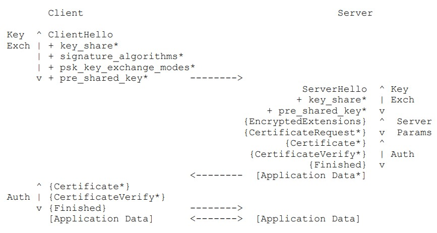

# 传输层安全协议v1.3
## 摘要
本文详细规定了传输层安全协议（TLS）的1.3版本。TLS允许客户端与服务端之间以一种防窃听，防篡改，防伪造的方式在互联网上通信

本文档更新了RFC 5705和RFC 6066，淘汰了 RFC 5007、RFC 5246和RFC 6961。本文也详细规定了对TLS v1.2实现的新要求

## Status of this Memo（略）
## Copyright Notice（略）

## 1. 序言

TLS的首要目标是在两个通信终端之间提供一个安全的信道；来自下层传输的唯一要求是一个可靠且有序的数据流。特别的，这个安全信道应该提供如下的几个特性：

- 身份验证：该信道的服务端因当永远是通过身份验证的终端，而客户端则是可选的。身份验证可以通过非对称密码进行（如RSA,ECDSA,EdDSA）或者对称预共享密钥（PSK）
- 保密性：在已建立完成的信道上发送的数据只能被收发数据的终端看到。TLS不会隐藏其传输的数据的长度，而终端可以填充TLS报文，以混淆长度并提高对流量分析技术的保护。
- 消息完整性：在已建立完成的信道上发送的数据不允许在不知不觉中被攻击者篡改。

即使面对完全控制网络的攻击者，这些特性也应该被保证，如RFC3552中所述。有关相关安全属性的更完整说明，请参见附录E。

TLS包括两个主要组件：

- 握手协议（第四章），它用于认证通信双方，协商加密模式和参数，并建立共享密钥。握手协议是为了防止篡改而设计的，发起攻击者不能使得通信双方协商出一组与原先正常连接时所不同的参数。
- 记录协议（第五章），它使用基于握手协议协商得到的参数来保证通信双方的数据安全。记录协议将数据流量分为若干记录，每条记录都由密钥进行独立的保护  
（注：记录，原文为Record，感觉翻译为分组/报文更贴切一点）

TLS是一个独立的应用协议，更高层的协议能够基于TLS进行透明传输。但是，本TLS标准并不明确规定高层协议如何利用TLS保障安全，如何启动TLS握手以及如何解析所交换的身份验证证书，这取决于运行在TLS之上的协议的设计者和实现者的判断。

本文定义了1.3版本的TLS。虽然TLS 1.3与以前的版本不直接兼容，但所有版本的TLS都包含了版本控制机制，如果客户端和服务器都支持通用版本，则该机制允许客户端和服务器以互操作方式协商通用版本。

本文档取代并废止了TLS的先前版本，包括TLSv1.2（RFC5246）。它还废除了TLS票证（RFC5077）中定义的机制，并将其替换为第2.2节的定义。因为TLS 1.3改变了密钥的派生方式，它在第7.5节中更新了RFC5705。它还改变了在线证书状态协议（OCSP）消息的承载方式，因此在第4.4.2.1节中更新了RFC6066和淘汰了RFC6961。

### 1.1 惯例和术语
本文中的关键词：“**必须（MUST）**”，“**必须不（MUST NOT）**”，“**需要（REQUIRED）**”，“**应当（SHALL）**”，“**不应当（SHALL NOT）**”，“**应该（SHOULD）**”，“**不应该（SHOULD NOT）**”，“**推荐（RECOMMENDED）**”，“**不推荐（NOT RECOMMENDED）**”，“**可以（MAY）**”，“**可选（OPTIONAL）**”，当且仅当他们以黑体（中文）或黑体全大写（英文）出现时，以BCP 14（RFC2119，RFC8174）中所述进行解释。  
（注：这些关键词在中文中都是近义词，但是可以看到按照上述顺序，严重性依次递减，在后续翻译中，有些地方使用使用大写且黑体的英文原文，这样更明显）

本文使用如下术语：

- 客户端（client）：发起初始化TLS连接的终端
- 连接（connection）：两个终端之间建立的传输层连接
- 终端（endpoint）：这个连接的客户端和服务端统称终端，或理解为连接的两端
- 握手（handshake）：客户端和服务器之间的初始化协商过程，用于建立TLS中后续交互的参数。
- 另一端（peer）：也是一个终端，当讨论一个特定的端点时，“peer”指的是不是主要讨论主题的终端。中文翻译使用简介易懂的：另一端
- 接收端（receiver）：接受记录的一端
- 发送端（sender）：发送记录的一端
- 服务端（server）：与客户端相对，被动接受初始化TLS连接的终端

本文使用如下翻译习惯或简称：

- 报文（原文：Message），或翻译为字段，消息
- 记录（原文：Record），或者理解为数据
- 传输层安全协议简称为TLS
- 迪夫-赫尔曼算法（Diffie-Hellman）简称为DH算法
- 预共享密钥（Pre Shared Key）简称PSK

### 1.2 与TLS v1.2的主要不同
### 1.3 影响TLS v1.2的更新

## 2. 协议概述
安全通道使用的加密参数是由TLS握手协议产生的。TLS的此子协议由客户端和服务器在首次相互通信时使用。握手协议允许对等方协商协议版本，选择加密算法，相互之间进行认证（可选），并建立共享的密钥。一旦握手完成，对等方就使用建立的密钥来保护应用层流量。

握手失败或其他协议错误会终止连接的，可选择在连接之前发送一条警告消息（第6章）。

TLS支持三种基础的密钥交换模式：

- (EC)DHE：有限域或椭圆域上的迪夫-赫尔曼（Diffie-Hellman）算法
- PSK-only：仅使用对称预共享密钥
- PSK with (EC)DHE：上述两种结合

下图展示了基本的TLS握手全流程：



其中符号”+“表示该报文因当发送；符号”*“表示并非总是发送的可选或取决于情况的报文/扩展；符号”{}“包含的部分表示该报文使用[sender]_handshake_traffic_secret派生的密钥加密；符号”[]“包含的部分表示该消息使用[sender]_handshake_traffic_secret_N派生的密钥加密。

如上图所示，握手可以被定义为三个阶段：

- 密钥交换：建立共享密钥并选择加密参数，在这之后的所有阶段都被加密。
- 服务端参数确定：确定其他的握手参数（客户端是否经过身份验证、应用层协议支持等）。
- 身份认证：认证服务端或客户端（可选）并提供密钥确认和握手完整性校验

在密钥交换阶段，客户端发送ClientHello报文（见4.1.2节），其包含一个临时随机数（ClientHello.random）。它提供了协议版本信息、对称密码/HKDF哈希对列表、一组DH共享密钥（在key_share扩展字段中，见4.2.8节）或者一组预共享密钥（在pre_key_share扩展字段中，见4.2.11节）或者都有、以及潜在的额外扩展字段。为了实现中间件兼容性，还可以存在额外的字段和消息。

服务端处理该ClientHello报文并选取一个合适的加密参数，然后响应ServerHello报文（见4.1.3节），其指示协商的连接参数。ClientHello和ServerHello共同确定共享密钥。如果使用(EC)DHE模式握手，则ServerHello报文包含一个”key_share“扩展字段，该字段包含服务端临时的DH共享密钥，这个共享密钥 **必须（MUST）** 与客户端的共享密钥之一在同一组中。如果使用PSK-only模式握手，则ServerHello报文包含一个”pre_key_share“扩展字段，其指明服务端选择了客户端提供的哪一个PSK。需要注意的是，实现者也可以一起使用(EC)DHE和PSK，这样以上两个扩展字段都应被包含。

服务端随后继续发送两个报文来确定服务端参数（即服务端参数确定阶段）：

- EncryptedExtensions：响应ClientHello扩展不需要确定加密参数，但特定于单个证书的参数除外。（见4.3.1节）（此处翻译存疑，且等我看到4.3.1节）
- CertificateRequest（可选）：如果需要基于证书的客户端身份验证，则需要该证书的所需参数。如果不需要客户端身份验证，则会省略此消息。（见4.3.2节）

最后，客户端和服务端交换身份认证报文（身份认证阶段）。每次需要基于证书的身份验证时，TLS都会使用相同的报文集，基于PSK的身份验证则是在密钥交换阶段附加完成。特别说明：

- Certificate：即终端的证书或任何预证书扩展（pre-certificate extension）。该报文将会被服务端省略当：服务端不使用基于证书的身份认证；该报文将会被客户端省略当：服务端在上一阶段未发送CertificateRequest报文给客户端（因此表明客户端不应使用证书进行身份验证）。需要注意的是如果原始公钥(RFC 7250)或缓存信息扩展(RFC 7924)正在被使用，则此消息不会包含证书而是包含一些与server的长期密钥相关的其它值。（见4.4.2节）
- CertificateVerify：使用证书中与公钥配套的私钥对以上全部的握手信息进行签名，如果该终端无需使用基于证书的身份验证，则省略该报文。（见4.4.3节）
- Finished：一个对上述所有数据的MAC（消息验证码），该报文提供密钥的确认、绑定终端身份与交换得到的密钥、在PSK模式中也用于认证本次握手。（见4.4.4节）

在接收到服务端的以上报文后，客户端也发送他的认证报文，即Certificate、CertificateVerify（如果需要）和Finished。

至此TLS握手完成，服务端和客户端得到一个密钥，用于在记录层通过已认证的加密交换应用层数据。除非第2.3节另有规定，否则 **必须不（MUST NOT）** 能在发送Finished报文之前发送应用程序数据。请注意，虽然服务器可以在接收客户端的身份验证消息之前发送应用程序数据，但此时发送的任何数据当然都会发送给未经身份验证的另一端。

### 2.1 不正确的DHE共享
如果客户端不能提供充足的“key_share”扩展（例如：它只包括服务器不可接受或不支持的DHE或ECDHE组），服务端使用HelloRetryRequest报文以纠正这些错误，此时客户端需要使用合适的“key_share”扩展重启握手流程，如下图所示。如果仍然无法协商出一个统一的加密参数，服务器 **必须（MUST）** 中止握手流程并发送合适的警告。
```
    Client                                 Server
ClientHello
+ key_share          -------->
                                    HelloRetryRequest
                     <--------            + key_share
ClientHello     
+ key_share          -------->
                                          ServerHello
                                          + key_share
                                {EncryptedExtensions}
                                {CertificateRequest*}
                                       {Certificate*}
                                 {CertificateVerify*}
                                           {Finished}
                     <--------    [Application Data*]
{Certificate*}     
{CertificateVerify*}
{Finished}           -------->
[Application Data]   <------->    [Application Data]
          图2：当发生错误时完整的握手报文流程
```
注：握手记录包含了最初的ClientHello/HelloRetryRequest报文交换；它不会用新的ClientHello重置。

TLS还允许基本握手的几种优化变体，如以下部分所述。

### 2.2 会话恢复与预共享密钥（PSK）